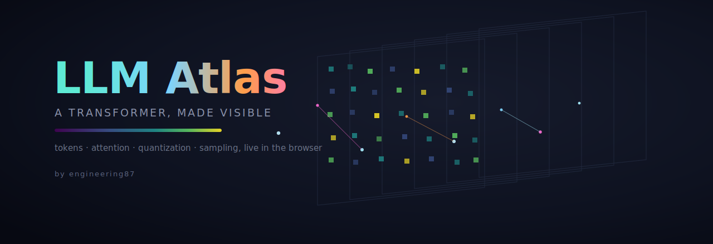
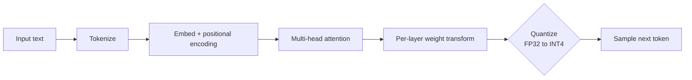

<p align="center">
  
</p>

<p align="center">
  <a href="https://calm-water-0a4775e10.7.azurestaticapps.net"></a>
  <a href="https://github.com/engineering87/llm-atlas/actions/workflows/ci.yml"></a>
  <a href="LICENSE"></a>
  
  
  
  
</p>

<h1 align="center">LLM Atlas</h1>

<p align="center"><em>An interactive, in-browser visualization of how a transformer language model actually works.</em></p>

<p align="center">
  <strong><a href="https://calm-water-0a4775e10.7.azurestaticapps.net">▶ Open the live demo</a></strong>
</p>

---

**LLM Atlas** turns the inside of a language model into something you can watch and touch. Type a sentence and see it become tokens, flow through six weight layers as embeddings, attend to one another through real query and key projections, get crushed by quantization, and finally turn into a next token chosen by temperature. It runs entirely in the browser, on a custom Canvas 2D engine, with no libraries, no build step, and no server.

It is built to work on two levels at once: it should pull in someone who has never thought about how these models work, through the live, glowing graphics, and it should still satisfy someone who knows the architecture, because the mechanisms underneath are faithful.

## The pipeline



Every box above is a stage you can watch, toggle, and inspect in the live demo.

## What it shows

Every stage of a transformer block, rendered live and inspectable:

- **Tokenization.** A typed sentence is split into tokens that populate the input sequence.
- **Embeddings.** Each token carries a latent vector, with sinusoidal positional encoding added at the input.
- **Multi-head attention.** Tokens attend to one another through real scaled dot-product attention across three heads, with optional causal masking that makes the attention map triangular.
- **Per-layer transforms.** At every layer the latent vector is multiplied by the local weight matrix, with a residual connection and a nonlinearity.
- **Quantization.** Switch between FP32, FP16, INT8, and INT4, and watch the weight distribution collapse, the memory figure drop, and the range of possible outputs shrink.
- **Sampling.** A softmax over the output scores becomes a probability distribution over next tokens, reshaped live by a temperature control.
- **KV cache.** A readout and per-layer bars show how the cache grows with context.

## Run it

It is a single self-contained file. Pick whichever is easiest:

- **Live demo.** Open [calm-water-0a4775e10.7.azurestaticapps.net](https://calm-water-0a4775e10.7.azurestaticapps.net), hosted on Azure Static Web Apps and redeployed automatically on every push to `main`.
- **Open directly.** Double click `index.html`, or drag it into any modern browser.
- **Serve locally.** From the project folder, run `python3 -m http.server` and open `http://localhost:8000`.

No installation, no dependencies, no API keys.

## Controls

| Control | What it does |
| --- | --- |
| **FP32 / FP16 / INT8 / INT4** | Set weight precision, and see the effect on memory and output |
| **speed / density** | How fast and how many tokens flow through the field |
| **temp** | Sampling temperature at the output |
| **ATTENTION** | Toggle inter-token attention on or off |
| **CAUSAL** | Toggle autoregressive masking, which makes the attention map triangular |
| **HEAD** | Cycle which attention head the heatmap shows |
| **FOCUS** | Follow a single token and watch its state change across the layers |
| **TOUR** | A short guided walkthrough that moves the camera and explains each stage |
| **ABOUT / ?** | A written overview, and a quick control reference |
| **GLOW** | Toggle the bloom effect |
| **+ / − , drag, scroll** | Zoom and orbit the scene |
| **click** | Click a token to follow it, or a weight cell to inspect its value across all four formats |

## How faithful is it

The mechanisms that matter are real: subword-style tokenization, positional encoding, scaled dot-product multi-head attention, causal masking, residual per-layer transforms, symmetric weight quantization, and temperature sampling. The quantization is exact in its deterministic part, and the memory figure for the weights is a real multiplication of parameters by bytes.

It is also, deliberately, a reduced model. The latent vector is six-dimensional rather than thousands, the projection weights are fixed rather than trained, attention is computed over co-located tokens rather than the full sequence, and the throughput and KV figures are proportional rather than measured. The goal is understanding, not benchmarking.

## Tests

The engine is checked by two dependency-free Node tests in [`test/`](test/), run in CI on every push and pull request: an interaction audit that drives every control and runs the loop for hundreds of frames, and a numeric test that verifies quantization actually collapses the weight distribution. See [`test/README.md`](test/README.md).

## Repository layout

```text
index.html                  the entire application: engine, interface, and styles
assets/                     banner and social preview images
test/                       dependency-free Node tests (audit, invariants)
staticwebapp.config.json    Azure Static Web Apps routing
.github/workflows/          continuous integration and Azure deployment
```

## Citation

If you reference LLM Atlas in your work, please cite it through the repository's [`CITATION.cff`](CITATION.cff), which GitHub also exposes through the "Cite this repository" button, or use:

> Del Re, Francesco. *LLM Atlas: an interactive transformer visualization*. 2026. https://github.com/engineering87/llm-atlas

## Author

Built by **Francesco Del Re** ([engineering87](https://github.com/engineering87)).

## License

Released under the [MIT License](LICENSE).
